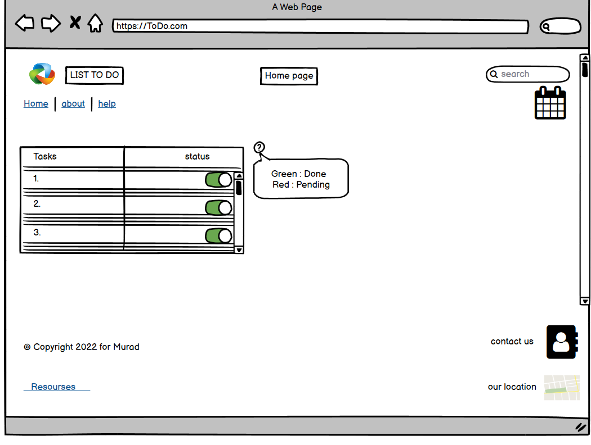
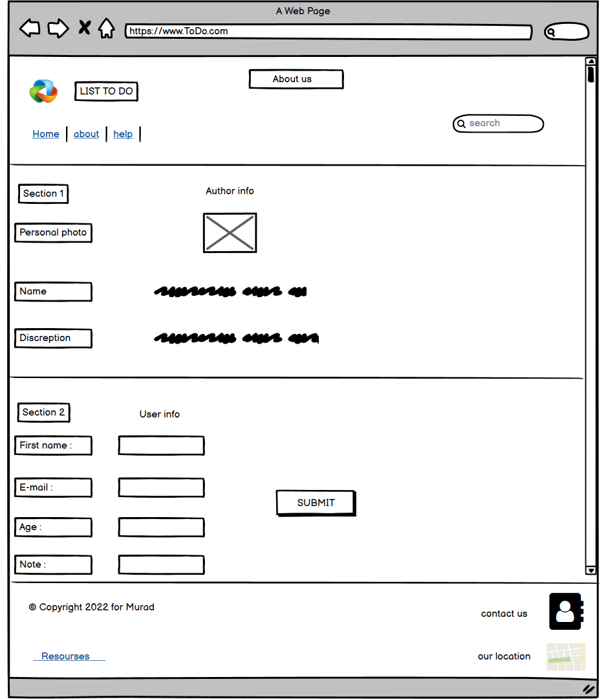

# todo-project
Task 3

## Index Wirefram 

this is a simple wirefram design using balsmiq , for the index page.

***
---

## About Wirefram

also this a simple wirefram design for the about page 

---
---
you can see also the tree command for todo-project

---
---

## Summary📃
**Q1) what is the different between block element and in line element in html?**

*Answer) the block level element it  alwayis take new line 
and in the preview page it will take full wideth of the page*

*the in line element will not take new line , i can be fit inside the line , and it will take the nessesary width*

**Q2)What observations or questions do you have about what you’ve learned so far?**

*Answer) what i observed in this project , first you have to understand what you learned , then you have to search for more information about the topic ,and you have to try everything you learned by your self , and correct any mistake ...*

*In my code i put the resources that i used , like i used ready made code , i used ready made code and i modified it , and i wrote my own code.*

***Thanks and Regards*** 💻📮

